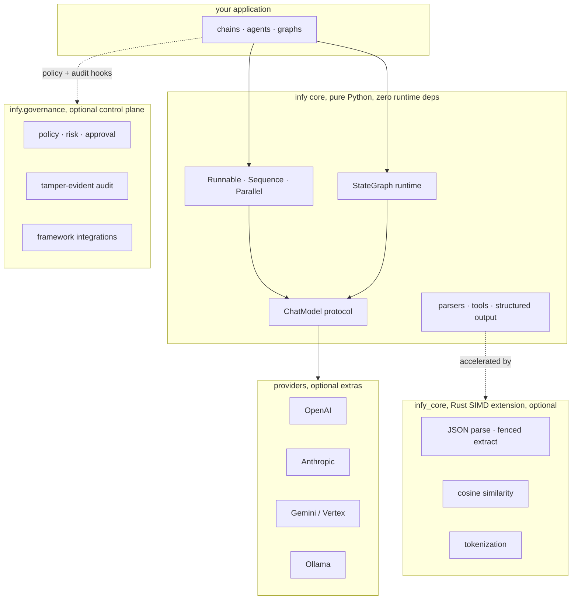

infy is built as concentric layers. A pure-Python core does all the orchestration. An optional Rust extension accelerates a few hot paths. An optional governance layer wraps the tool chokepoint. Optional providers connect to model APIs. Every optional layer degrades cleanly when it is absent, so the framework runs on a bare interpreter with nothing installed but `infy` itself.

## The layers

<CardGroup cols={2}>
  <Card title="Core" icon="cube">
    Pure Python, zero third-party runtime dependencies. Runnables, the `ChatModel` protocol, parsers, tools, structured output, and the `StateGraph` runtime.
  </Card>
  <Card title="Rust core" icon="microchip">
    The optional `infy_core` SIMD extension. Accelerates JSON parsing, cosine similarity, and tokenization, with a pure-Python fallback.
  </Card>
  <Card title="Governance" icon="shield-check">
    The optional in-process control plane. Deny-by-default policy, risk tiering, human and durable approval, and a tamper-evident audit.
  </Card>
  <Card title="Providers" icon="plug">
    Optional extras. OpenAI, Anthropic, Gemini or Vertex, and Ollama, each behind the same `ChatModel` protocol.
  </Card>
</CardGroup>



## The pure-Python core

The core is the whole framework. It has no third-party runtime dependencies, so it runs on a bare interpreter. It provides everything you need to build chains, agents, and stateful graphs.

- **Runnables.** `Runnable`, `Sequence`, and `Parallel` compose with the `|` operator. Plain callables, dicts, and tools are coerced automatically.
- **The `ChatModel` protocol.** A single surface (`generate`, `agenerate`, `stream`, `astream`, `bind_tools`, `with_structured_output`) that every provider implements, so models are interchangeable in chains, agents, and graphs.
- **Parsers, tools, and structured output.** `JsonParser`, the `@tool` decorator, and `with_structured_output` for JSON-schema or pydantic results.
- **The `StateGraph` runtime.** A bulk-synchronous (Pregel-style) superstep executor with typed channels, reducers, conditional routing, dynamic fan-out, checkpointing, and interrupt or resume.

Everything in the core is async-first and sync-complete. Every model, runnable, and graph exposes both a sync and an async surface with identical semantics.

## The Rust core

`infy_core` is an optional compiled extension. It accelerates the parsing and math hot paths with SIMD, but it is not required to run anything.

| Accelerated path | What it does |
| --- | --- |
| JSON parse, fenced extract | Fast structured-output parsing and code-fence extraction |
| Cosine similarity | Vectorized similarity for embeddings |
| Tokenization | Faster token counting on the hot path |

Build it into your active environment with `maturin develop --release`.

<Warning>
Build the Rust core in release mode. Debug builds fail the performance checks.
</Warning>

## Graceful degradation

This is the core guarantee: every module that uses the Rust extension falls back to a pure-Python implementation. The framework is fully functional with `infy_core` absent. When you `pip install infy`, you get the Rust extension if a wheel is available for your platform, and the pure-Python fallback if it is not.

<Note>
The fallback is transparent. Your code does not change, only the speed of the accelerated paths does. The pure-Python layer produces the same results.
</Note>

The same principle extends outward through every optional layer:

- **Providers are optional extras.** Install only the ones you use (`infy[openai]`, `infy[anthropic]`, `infy[gemini]`, `infy[ollama]`, or `infy[all]`).
- **pydantic is optional.** It is pulled in only for validated structured output (`infy[pydantic]`), and only used when you opt in.
- **Governance is optional and imports nothing until you opt in.** Omit it and nothing changes and nothing is imported.

## The governance control plane

Governance is a separate, optional layer wired into the agent loop at the tool chokepoint. Opt in and every tool call is policy-checked in-process, and every step is written to a tamper-evident audit trail.

- **Policy, risk, and approval.** Deny-by-default, fail-closed policy behind a `PolicyEngine` protocol, static risk tiering, and a pluggable `Approver`, including `DurableAgent` for out-of-band sign-off.
- **Tamper-evident audit.** An append-only, SHA-256 or HMAC hash-chained log with `verify()`.
- **Framework integrations.** `infy.integrations` wraps the tool or action chokepoint of smolagents, LangChain, and OpenHands agents with the same governance, without changing them.

Enforcement is in-process by design. A network hop before every tool call would erase infy's cold-start and latency advantage, so the heavy operated pieces attach behind the same protocol seams as the commercial layer.

<Tip>
Governance is measured at about 50 microseconds per tool call, roughly 0.003% of the LLM call it guards, so you can leave it on. See [Governance](/governance/overview) for the full model.
</Tip>

## Repository layout

```text
infy/            pure-Python framework (zero runtime deps)
  graph/         StateGraph, channels, checkpointing, interrupts
  governance/    optional in-process control plane (policy, risk, approval, audit)
  integrations/  govern smolagents, LangChain, and OpenHands agents
  providers/     OpenAI, Anthropic, Gemini, Ollama
core-rust/       Rust SIMD extension (infy_core)
tests/           strict mypy, ruff, pytest
```

## Next steps

<CardGroup cols={2}>
  <Card title="Quickstart" icon="rocket" href="/quickstart">
    Install infy and run your first model call.
  </Card>
  <Card title="The graph runtime" icon="diagram-project" href="/graph/overview">
    Build stateful graphs with checkpointing and interrupts.
  </Card>
  <Card title="Governance" icon="shield-check" href="/governance/overview">
    Give an agent real authority safely and prove what it did.
  </Card>
  <Card title="Providers" icon="plug" href="/providers">
    Connect OpenAI, Anthropic, Gemini, or Ollama.
  </Card>
</CardGroup>
