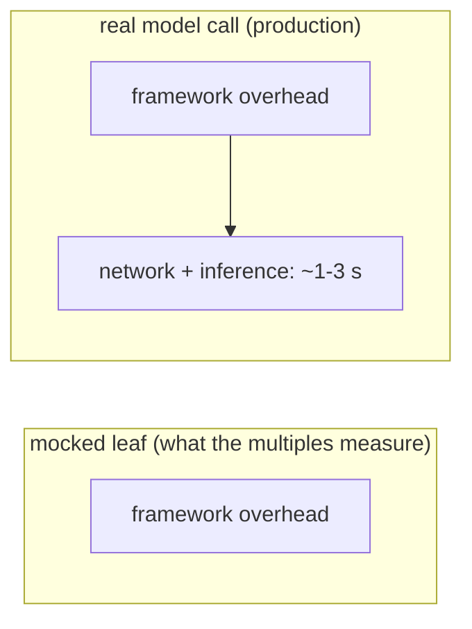

Framework overhead is small, invisible, and easy to fake with a favorable microbenchmark. infy is measured to avoid exactly that. Every number on this page is framework overhead isolated over a deterministic offline leaf, verified byte-identical between the two ports before any timing is trusted.

## How infy is measured

Framework overhead is isolated by porting real LangChain and LangGraph projects to infy and replacing the LLM call with a **deterministic, offline leaf**: no API keys, no GPU, no network. Only the orchestration differs between the two ports, so the difference *is* the framework. Every port is verified to produce **byte-identical output** before any timing is trusted.

<Steps>
  <Step title="Start from a real project">
    Take an existing LangChain or LangGraph agent, not a toy written to flatter one side.
  </Step>
  <Step title="Port to both frameworks over a shared leaf">
    Produce two orchestrations, port A on LangGraph and port B on infy, that call the same deterministic mocked leaf.
  </Step>
  <Step title="Verify byte-identical output">
    Run both. If the outputs differ, fix the port. Do not measure a port that has not reached parity.
  </Step>
  <Step title="Measure the ratios">
    With output held identical, measure orchestration LOC, cold start, per-invoke latency, and RSS over a bare-interpreter baseline.
  </Step>
</Steps>

<Note>
The **ratios** are the portable result, not the absolute milliseconds. Timings are machine-relative; ratios carry across machines.
</Note>

### What each metric means

| Metric | Definition |
| --- | --- |
| Orchestration LOC | Logical lines (tokenised `NEWLINE` count) of the orchestration file; shared mock leaves excluded. |
| Cold start | Fresh interpreter, then import framework and compile the graph, in a subprocess. Minimum of 6 runs. |
| Loop latency | Per-`invoke` framework overhead over the scenario suite with mocked leaves, in µs or ms. |
| RSS over baseline | Peak resident memory of (import + build + run) minus a bare-interpreter baseline, via `psutil`. |

**Environment.** Windows, CPython 3.13, virtualenv. Release build of the Rust core (`maturin develop --release`). LangGraph 1.x and langchain-core 1.x.

## The headline

Across a corpus of about 37 community agents, offline and with framework overhead isolated, the median result is:

| Dimension | infy vs LangChain / LangGraph |
| --- | --- |
| Cold start (import + compile) | **8.6x faster** |
| Resident memory | **5.4x lighter** |
| Per-invocation framework overhead | **21x lower** |
| Orchestration LOC | **parity** |

The LOC story is the quiet one: most ports are the LangGraph file with a single import line changed, so parity is expected. A handful came out meaningfully smaller.

### The full range across the 37 agents

| Dimension | Median | Range |
| --- | --- | --- |
| Cold start | 8.6x faster | 2.5x to 9.9x |
| Resident memory | 5.4x lower | 1.9x to 8.1x |
| Per-invocation framework overhead | 21x lower | 10x to 609x |
| Orchestration LOC | parity (1.00x) | 0.92x to 1.74x |

The lighter graphs cluster high on cold start, most landing near 8 to 9x, because there is less per-graph work to dilute infy's lean import. The honest low end is the smallest graph in the corpus, an academic task-planning agent, where the framework does the least: its cold-start edge shrinks to 2.5x and memory to 1.9x.

## The conservative view

On seven heavier ported projects (finance fan-outs, ReAct loops, nested subgraphs, middleware stacks), the advantage is smaller but still decisive:

| Dimension | infy vs LangChain / LangGraph |
| --- | --- |
| Cold start | **2.7x to 6.8x faster** |
| Resident memory | **2.7x to 5.5x lower** |
| Per-invocation framework overhead | **12x to 93x lower** |
| Orchestration LOC | parity to moderately smaller |

The latency advantage scales with how much framework machinery the incumbent layers on: pydantic state, LCEL structured output, nested subgraphs, and middleware stacks all widen the gap.

<Accordion title="The seven heavier projects, per-project">

Ratios are infy-relative: higher is better, and for LOC, `>1.0x` means infy is smaller.

| # | Project | LOC | Cold start | Loop latency | RSS |
| --- | --- | --: | --: | --: | --: |
| 01 | Medical-assistant agent | 0.96x | 4.48x | 29.98x | 5.04x |
| 02 | Research / ReAct agent | 1.16x | 3.91x | 12.46x | 3.08x |
| 03 | Multi-analyst finance agent | 1.10x | 3.63x | 29.96x | 2.68x |
| 04 | Browser-automation agent | n/a | 0.69x | 1.67x/step | 1.23x |
| 05 | Software-engineering agent | 1.16x | 3.98x | 47.14x | 3.08x |
| 06 | Data-generation agent | 1.20x | 5.55x | 19.34x | 5.00x |
| 07 | Terminal / CLI agent | 1.18x | 6.78x | 93.15x | 5.51x |

Project 04 (the browser-automation agent) is the honest counter-example: a per-step pydantic agent, not a LangGraph, where the incumbent's fused `pydantic-core` `model_validate_json` beat infy's older two-pass parse. That gap has since been addressed. `with_structured_output` now delegates to `pydantic-core.model_validate_json` when given a pydantic model.

</Accordion>

## The honest caveat

The per-invocation multiples (12x to 93x, and higher on the simplest agents) measure a real CPU cost, but they describe the *framework's* time, not the request's. Once a live model call is in the loop, a ~1 to 3 s network round-trip dominates, and end-to-end wall clock between frameworks is effectively at parity.

<Warning>
On a live, billed run against a real model, measured wall-clock was **1.05x to 1.14x**: at parity. Do not read the per-invoke multiples as end-to-end speedups. They are not.
</Warning>

What survives into production is **cold start** and **memory footprint**, costs paid on every request and per running agent. That is why infy targets serverless, edge, and high-density multi-tenant deployments, where those are the dominant terms.

## Coverage and what was excluded

The corpus was a public collection of roughly fifty community agent tutorials. Gaps are documented, not forced: no infy feature was added to win a port.

- **37 ported and verified** byte-identical, then measured.
- **12 documented as out of scope**, built on a different framework, or driven by a live external service (web search, image or audio generation, a real vector store, or MCP servers) that cannot be reduced to a deterministic offline leaf.
- **2 did not reach byte-identical parity** and were dropped rather than reported.

## Governance, free enough to leave on

The [governance layer](/governance/overview) runs in-process at the tool chokepoint, so the fair question is whether it is cheap enough to enable on every agent. Measured on a real `create_agent` loop issuing 5 tool calls, with all arms producing byte-identical output:

| Arm | Cold start | RSS over baseline | Latency / run |
| --- | --: | --: | --: |
| infy (ungoverned) | 129 ms | 9.2 MB | 0.019 ms |
| infy + governance | 145 ms | 10.7 MB | 0.246 ms |
| LangChain (ungoverned) | 980 ms | 54.6 MB | 8.3 ms |
| LangChain + middleware | 967 ms | 54.8 MB | 9.2 ms |

infy governance adds about **50 µs per tool call**. Against the ~1 to 2 s real LLM call it guards, that is roughly **0.003%** overhead. Governance is free enough to leave on for every agent.

## Reproduction

The benchmark harness (ported projects plus measurement scripts) is kept out of the published package. The methodology above is enough to reproduce the shape of the results: port a project to both frameworks, share a deterministic leaf, verify byte-identical output, then measure LOC, subprocess cold start, per-invoke latency, and RSS over a bare-interpreter baseline. Ratios are portable across machines; absolute timings are not.

<CardGroup cols={2}>
  <Card title="Governance overview" icon="shield" href="/governance/overview">
    The in-process control plane the governance benchmark measures.
  </Card>
  <Card title="The graph runtime" icon="diagram-project" href="/graph/overview">
    The superstep executor whose cold start and memory these numbers isolate.
  </Card>
</CardGroup>
